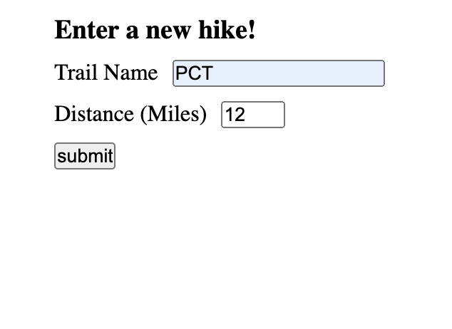
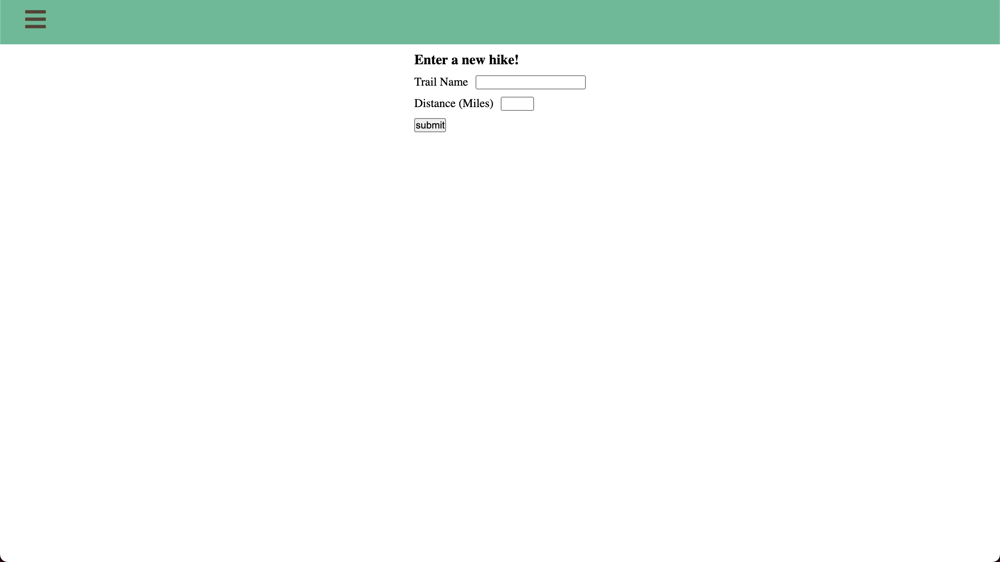
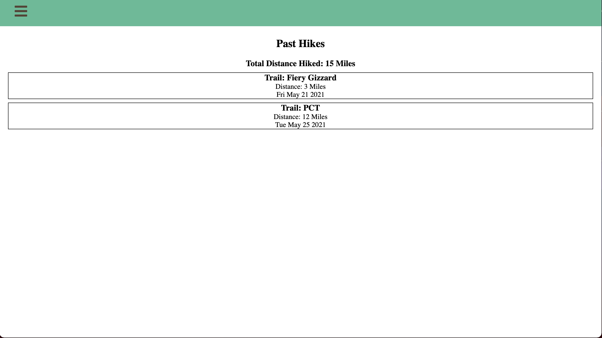

# Hike-Tracker

https://opensource.org/licenses/MIT

## Description

A full-stack (MongoDB, Express, React.js, Node.js) web application that allows the user to store hike names, dates, and distances in a MongoDB database and also keeps track of the user's total hike mileage.

This application is deployed at: https://hike-tracker-v2.herokuapp.com/
      
## Table of Contents 
      
* [Installation](#installation)
      
* [Usage](#usage)
      
* [Contributing](#contributing)

* [Next](#next)
      
* [Questions](#questions)

* [License](#license)
      
## Installation

npm i to install all relevant dependencies
      
## Usage

Currently, this application allows the user to enter new hike data (for trail name and distance):

View past hikes with total mileage:

Use the sliding nav menu to navigate the site:

        
## Contributing

If you would like to make a contribution (or know of a good source of information for trails) simply make a pull request with a detailed description of your contribution, or feel free to contact me at my email: Charles.f.latrobe@gmail.com.
      
## Next
      
The most pressing feature I would like to add is a search feature that allows the user to locate a specific hiking area from a database- difficulties in finding an API that is supported and supplies trail information.

      
## Questions

For questions regarding this repo contact me at Charles.f.latrobe@gmail.com or visit my repository at https://github.com/Clatrobe00

## License

Copyright 2021 undefined

    Permission is hereby granted, free of charge, to any person obtaining a copy of this software and associated documentation files (the "Software"), to deal in the Software without restriction, including without limitation the rights to use, copy, modify, merge, publish, distribute, sublicense, and/or sell copies of the Software, and to permit persons to whom the Software is furnished to do so, subject to the following conditions:
    
    The above copyright notice and this permission notice shall be included in all copies or substantial portions of the Software.
    
    THE SOFTWARE IS PROVIDED "AS IS", WITHOUT WARRANTY OF ANY KIND, EXPRESS OR IMPLIED, INCLUDING BUT NOT LIMITED TO THE WARRANTIES OF MERCHANTABILITY, FITNESS FOR A PARTICULAR PURPOSE AND NONINFRINGEMENT. IN NO EVENT SHALL THE AUTHORS OR COPYRIGHT HOLDERS BE LIABLE FOR ANY CLAIM, DAMAGES OR OTHER LIABILITY, WHETHER IN AN ACTION OF CONTRACT, TORT OR OTHERWISE, ARISING FROM, OUT OF OR IN CONNECTION WITH THE SOFTWARE OR THE USE OR OTHER DEALINGS IN THE SOFTWARE.